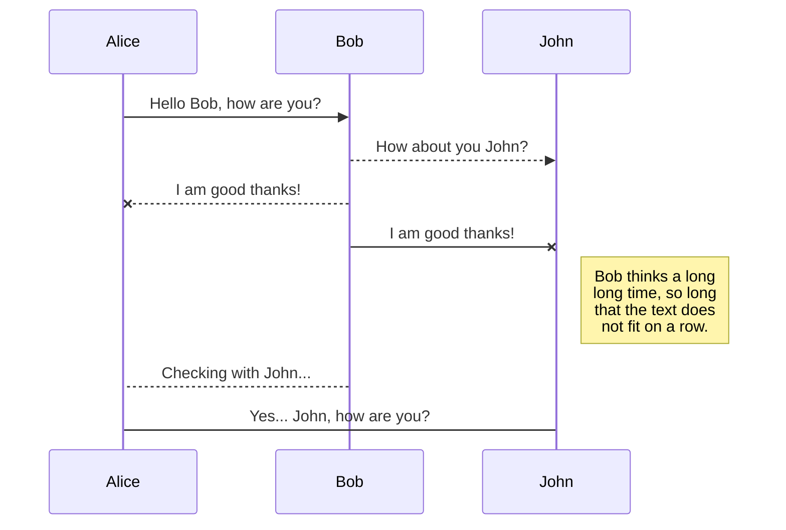

# The Conventional method of Integrated Development Environment (IDE) Setup

> The below explanation covers everything best for both the questions. Due to the time constraint I haven’t written this paper in Markdown, but I have very good knowledge of Html, Javascript, C, C++, Java, CSS, and Markdown. I understand the base of syntax required for different programming languages. Being BCA, MCA from the University of Pune I am able to grasp the technical concepts quite easily.
>

Let’s recall the conventional method of setting up an Integrated Development Environment (IDE) for creating the applications. To setup the IDE means to iterate through number of documents and follow the processes to make the application ready for development. There may be number of dependencies and sequences that may be required to be followed to get the application environment ready for development.

For sake of simplicity, let me take an example of readying the IDE JCreator for creating java applications.

The prerequisite for the JCreator installation is to install java. Typically, the location where Java is placed on your computer would be: C:\Program Files\Java\jdk1.5.0_01

Now that you have installed java, run the **JCreator exe** file to complete the installation process. During the installation process, follow the steps to configure the  **JDK Profiles**, setup the **environment variable** and make it ready for development.

But wait, this is not as easy as it seems. The application may encounter number of hurdles if there is a version mismatch (…jdk1.5.0_01) with what JCreator version supports, misconfigured JDK Profiles or if the project location changes, or there may need to re-configure the environment variable.

In some cases, we may need to uninstall the current version of Java and install the compatible version of Java. This is something you can never find during installation because the Operating System doesn’t know which version of JCreator  would be used and unless you configure the JDK Profiles, setup the environment variable and run your first programme.

The problems with conventional methods are:

1. To develop applications, one may need to remember the prerequisite to setup the development environment.

2. The sequence is important to install the dependencies.

3. All the dependencies should be present to setup the IDE for working successfully.

4. The version mismatch may need you to setup the application again to match the system compatibilities and re-configure a few things.

5. Consider the case where you need to install a complex application which demands matching .Net Framework(s), etc. or the OS level things where latest version of .Net Framework doesn’t come pre-installed.

6. Sometimes one may need to look for the down-graded version of the .Net for backward compatibility either for setting up the application or support the app development versions.

Let’s take another example of readying **ABP Framework** which is a complete open-source infrastructure to create modern web applications. ABP Framework supports configuring the Documentation Module named ABP VoloDocs. It means configuring a whole Documentation Module with the application to make it ready for documentation.

To configure the documentation module in ABP Framework, one may encounter the underlying issues:
1. Number of sequences and prerequisites are required to be followed.

2. If there is version mis-match for any of these prerequsites, the framework wouldn’t work entirely.

3. The underlying issues may need number of services to be stopped and run to make the framework work.

4.  The process itself is not just tedious but also time-consuming.

5. That’s why most developers haven’t even heard about it or have no experience working with ABP Framework.

6. It has no popularity just because of the tedious setup and time-consumption just to setup IDE for the applications development.

## **What is Docker**

Docker is an innovative technology that has transformed the way web-developers can build, ship, and run the applications. Docker provides a complete new experience to the web developers for creating the projects. With the help of Dockers, the developers need not to be worried about setting up the IDE and will have the ready environment to develop the applications.

**What Docker Offers and how it enhances productivity**

Docker lets developers build, test, and deploy applications quickly. Using Docker, one can quickly deploy and scale applications into any environment and know that code will run. Running Docker on AWS provides developers and admins a highly reliable, low-cost way to build, ship, and run distributed applications at any scale.

Docker speeds up the software development processes, supporting micro services architecture, simplifies application deployment in cloud environments, and even enhancing reproducibility.

**The benefits of Docker**

The key benefit of Docker is that it allows users to package an application with all of its dependencies into a standardized unit for software development. In other words, to develop an application the Docker will provide all the dependencies and prerequisites to develop an application inside the containers.

You may have encountered the problems where the code runs perfectly on developer’s machine but it stops working on other machine.
A [link](https://github.com/chetkp/Docker_Images/blob/main/image.jpg).

An image: 

A sized image: 

## New files

Making files small  **New file** is to okay **New folder** I guess.

## Switch to another file

This is all plain text

## Rename a file

You can rename the current file by clicking the file name in the navigation bar or by clicking the **Rename** button in the file explorer.

## Delete a file

You can delete t he file **Remove** yes **Trash** it is true.
## Export a file

Export file **Export to disk** in the menu. Okay.


# Synchronization

- This represents bullet
> Feeder
> i gues
> ok i got it
** Represents bold **

There are two types of synchronization and they can complement each other:

- The workspace synchronization will sync all your files, folders and settings automatically. This will allow you to fetch your workspace on any other device.
	> To start syncing your workspace, just sign in with Google in the menu.

- The file synchronization will keep one file of the workspace synced with one or multiple files in **Google Drive**, **Dropbox** or **GitHub**.
	> Before starting to sync files, you must link an account in the **Synchronize** sub-menu.

## Open a file

You can open a file from **Google Drive**, **Dropbox** or **GitHub** by opening the **Synchronize** sub-menu and clicking **Open from**. Once opened in the workspace, any modification in the file will be automatically synced.

## Save a file

You can save any file of the workspace to **Google Drive**, **Dropbox** or **GitHub** by opening the **Synchronize** sub-menu and clicking **Save on**. Even if a file in the workspace is already synced, you can save it to another location. StackEdit can sync one file with multiple locations and accounts.

## Synchronize a file

Once your file is linked to a synchronized location, StackEdit will periodically synchronize it by downloading/uploading any modification. A merge will be performed if necessary and conflicts will be resolved.

If you just have modified your file and you want to force syncing, click the **Synchronize now** button in the navigation bar.

> **Note:** The **Synchronize now** button is disabled if you have no file to synchronize.

## Manage file synchronization

Since one file can be synced with multiple locations, you can list and manage synchronized locations by clicking **File synchronization** in the **Synchronize** sub-menu. This allows you to list and remove synchronized locations that are linked to your file.

To add hyperlink you need to do it like the [Text] (https://chetkamalparkash.blogspot.com) just like this.

# Publication

Publishing in StackEdit makes it simple for you to publish online your files. Once you're happy with a file, you can publish it to different hosting platforms like **Blogger**, **Dropbox**, **Gist**, **GitHub**, **Google Drive**, **WordPress** and **Zendesk**. With [Handlebars templates](http://handlebarsjs.com/), you have full control over what you export.

> Before starting to publish, you must link an account in the **Publish** sub-menu.

## Publish a File

You can publish your file by opening the **Publish** sub-menu and by clicking **Publish to**. For some locations, you can choose between the following formats:

- Markdown: publish the Markdown text on a website that can interpret it (**GitHub** for instance),
- HTML: publish the file converted to HTML via a Handlebars template (on a blog for example).

## Update a publication

After publishing, StackEdit keeps your file linked to that publication which makes it easy for you to re-publish it. Once you have modified your file and you want to update your publication, click on the **Publish now** button in the navigation bar.

> **Note:** The **Publish now** button is disabled if your file has not been published yet.

## Manage file publication

Since one file can be published to multiple locations, you can list and manage publish locations by clicking **File publication** in the **Publish** sub-menu. This allows you to list and remove publication locations that are linked to your file.


# Markdown extensions

StackEdit extends the standard Markdown syntax by adding extra **Markdown extensions**, providing you with some nice features.

> **ProTip:** You can disable any **Markdown extension** in the **File properties** dialog.


## SmartyPants

SmartyPants converts ASCII punctuation characters into "smart" typographic punctuation HTML entities. For example:

|                |ASCII                          |HTML                         |
|----------------|-------------------------------|-----------------------------|
|Single backticks|`'Isn't this fun?'`            |'Isn't this fun?'            |
|Quotes          |`"Isn't this fun?"`            |"Isn't this fun?"            |
|Dashes          |`-- is en-dash, --- is em-dash`|-- is en-dash, --- is em-dash|


## KaTeX

You can render LaTeX mathematical expressions using [KaTeX](https://khan.github.io/KaTeX/):

The *Gamma function* satisfying $\Gamma(n) = (n-1)!\quad\forall n\in\mathbb N$ is via the Euler integral

$$
\Gamma(z) = \int_0^\infty t^{z-1}e^{-t}dt\,.
$$

> You can find more information about **LaTeX** mathematical expressions [here](http://meta.math.stackexchange.com/questions/5020/mathjax-basic-tutorial-and-quick-reference).


## UML diagrams

You can render UML diagrams using [Mermaid](https://mermaidjs.github.io/). For example, this will produce a sequence diagram:
```
->> Hello 
```


And this will produce a flow chart:

```mermaid
graph LR
A[Square Rect] -- Link text --> B((Circle))
A --> C(Round Rect)
B --> D{Rhombus}
C --> D


